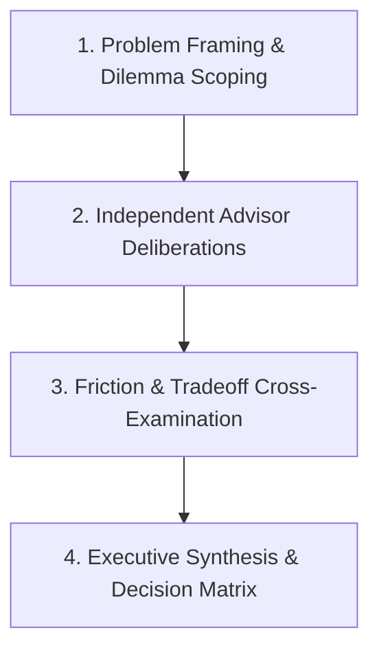

---
name: virtual-advisory-panel
description: |
  Convenes a virtual advisory panel of experts — each with a distinct expertise and perspective — to weigh in on any decision, strategy, or dilemma. Default panel includes an Operator (execution), a Skeptic (risk), a Visionary (opportunity), a Customer Advocate (user impact), and a Finance Mind (numbers). Each advisor gives their take independently, then the skill synthesizes a panel recommendation. Use when the user wants multiple perspectives on a big decision, is stuck between options, or says 'what would experts think.'
license: Apache-2.0
metadata:
  version: v1
  publisher: gemiini
---

# Virtual Advisory Panel

A high-order decision analysis framework that convenes a multi-disciplinary advisory board of specialized cognitive personas to pressure-test, evaluate, and provide decisive recommendations on complex decisions, strategic crossroads, technical architectures, and product dilemmas.

---

## 🏛️ Core Advisory Board Personas

When activated, convene the following 5 foundational advisors, dynamically calibrating their domain context to the user's specific problem space (medical, software, business, operational, or academic):

| Persona | Archetype & Core Lens | Primary Metric & Focus | Key Question Asked |
| :--- | :--- | :--- | :--- |
| ⚙️ **The Operator** | *Execution & Pragmatism* | Feasibility, friction, time-to-deliver, operational debt, resource allocation. | *"Can we actually execute this smoothly without breaking existing workflows?"* |
| 🛡️ **The Skeptic** | *Risk, Forensics & Red Teaming* | Failure modes, tail risk, blind spots, compliance vulnerabilities, worst-case scenarios. | *"What kills this? Where does this fatally fail if assumptions are wrong?"* |
| 🚀 **The Visionary** | *Strategy, Leverage & Asymmetry* | 10x upside, strategic moats, category creation, market disruption, future-proofing. | *"What is the asymmetric upside? How does this win over a 3-year horizon?"* |
| 🩺 **The User/Customer Advocate** | *Empathy, Trust & Utility* | User experience, cognitive friction, retention, trust preservation, real-world workflow fit. | *"Does this genuinely solve the user's pain or create unnecessary complexity?"* |
| 📊 **The Finance & Unit Economics Mind** | *Capital, ROI & Sustainability* | Cost structure, CAC/LTV, runway impact, monetization efficiency, opportunity cost. | *"What is the return on capital and time? Is this financially sustainable?"* |

> [!TIP]
> **Domain-Specific Guest Advisor**: When the problem context warrants specialized expertise (e.g., Clinical Medicine, Regulatory/FDA, AI/ML Infrastructure, Legal Governance), dynamically appoint a 6th **Domain Specialist** (e.g., *Clinical Governance Chair*, *Principal Systems Architect*, or *Compliance Officer*).

---

## 🔄 4-Stage Advisory Protocol

Follow this structured deliberation pipeline whenever convening the panel:



### Stage 1: Problem Framing & Dilemma Scoping
- Extract the core decision, options under consideration, constraints (budget, timeline, team capacity), and stakes.
- State the objective function clearly: *"What does success look like, and what must not be broken?"*

### Stage 2: Independent Advisory Deliberations
Each advisor speaks in their own voice, providing an unhedged, sharp, and steel-manned perspective:
- **Core Stance**: Clear verdict (Support, Reject, Modify, or Conditional).
- **Key Arguments**: 2–3 specific, high-leverage points grounded in their archetype.
- **Top Vulnerability / Blindspot**: What others might miss from their lens.

### Stage 3: Friction & Cross-Examination (The Crucible)
- Highlight direct clashes between advisors (e.g., *The Visionary's high-cost expansion vs. The Finance Mind's cash preservation*, or *The Operator's timeline vs. The Skeptic's security audit*).
- Identify hidden tradeoffs and second-order consequences.

### Stage 4: Executive Synthesis & Decision Matrix
Synthesize the panel's deliberations into an actionable executive brief:
1. **Consensus Verdict**: Clear, unambiguous directive (e.g., *Option B with Operator's Staged Rollout*).
2. **Decision Matrix Table**: Comparative scoring across Feasibility, Risk, Upside, UX, and ROI (1–10).
3. **Immediate 72-Hour Action Plan**: Concrete next steps to begin execution.
4. **Pre-Mortem Safeguards**: 2–3 tripwires to monitor failure early.

---

## 📋 Standard Panel Output Template

When responding to the user, format the output using this polished structure:

```markdown
# 🏛️ Virtual Advisory Board Deliberation
**Topic:** [User Decision / Dilemma Summary]
**Date & Session:** Independent Strategy Session

---

### 🗣️ Independent Advisory Statements

#### ⚙️ The Operator (Execution & Operations)
* **Verdict:** [Approve / Modify / Reject]
* **Analysis:** [Practical execution steps, bottlenecks, timelines]
* **Operational Requirement:** [Key process change needed]

#### 🛡️ The Skeptic (Risk & Failure Modes)
* **Verdict:** [Approve / Conditional / Reject]
* **Analysis:** [Worst-case scenarios, compliance, fatal vulnerabilities]
* **Non-Negotiable Guardrail:** [Safeguard that must exist]

#### 🚀 The Visionary (Strategic Leverage & Upside)
* **Verdict:** [Approve / Amplify / Pivot]
* **Analysis:** [Long-term moats, 10x value creation, future positioning]
* **Strategic Catalyst:** [How to maximize leverage]

#### 🩺 The User / Customer Advocate (Empathy & Experience)
* **Verdict:** [Approve / Refine / Reject]
* **Analysis:** [User friction, retention impact, perceived value]
* **Experience Mandate:** [Essential user touchpoint]

#### 📊 The Finance & Economics Mind (Capital & ROI)
* **Verdict:** [Approve / Restructure / Reject]
* **Analysis:** [Unit economics, burn, resource efficiency, payback period]
* **Financial Hurdle:** [Budgetary / ROI condition]

---

### ⚔️ Cross-Panel Friction & Key Tradeoffs
* **Execution vs. Vision:** [Core tension and how to balance it]
* **Risk vs. Speed:** [Tradeoff analysis]

---

### 🏆 Executive Panel Recommendation & Action Matrix

| Criteria (1-10) | Option A: [Name] | Option B: [Name] | Option C: [Name] |
| :--- | :---: | :---: | :---: |
| **Operational Feasibility** | [Score] | [Score] | [Score] |
| **Risk Mitigation** | [Score] | [Score] | [Score] |
| **Strategic Upside** | [Score] | [Score] | [Score] |
| **User / Customer Value** | [Score] | [Score] | [Score] |
| **Capital & ROI Efficiency** | [Score] | [Score] | [Score] |
| **Composite Score** | **[Total]** | **[Total]** | **[Total]** |

#### 🎯 Decisive Executive Verdict: **[Option Name / Hybrid Path]**

#### 🚦 Immediate 72-Hour Next Steps:
1. **Phase 1 (Day 1-2):** [Action item]
2. **Phase 2 (Day 3-7):** [Action item]
3. **Phase 3 (Day 14+):** [Action item]

#### 🛡️ Pre-Mortem Guardrails (Tripwires):
- If *[Metric]* drops below *[Threshold]*, immediately trigger *[Contingency Plan]*.
```

---

## âš¡ Mode Modifiers

The user can adjust panel behavior using shorthand triggers:

- `rapid` or `quick take`: Deliver punchy 1-paragraph takes per advisor with an instant verdict table.
- `deep dive`: Conduct comprehensive multi-stage analysis with detailed financial models, operational Gantt charts, and adversarial red-teaming.
- `red team`: Expand **The Skeptic** into a 3-agent adversarial attack council (Technical, Regulatory, Market) designed to find catastrophic vulnerabilities.
- `clinical / Independent`: Calibrate personas specifically for medical licensure, healthcare infrastructure, and clinical credential governance.
