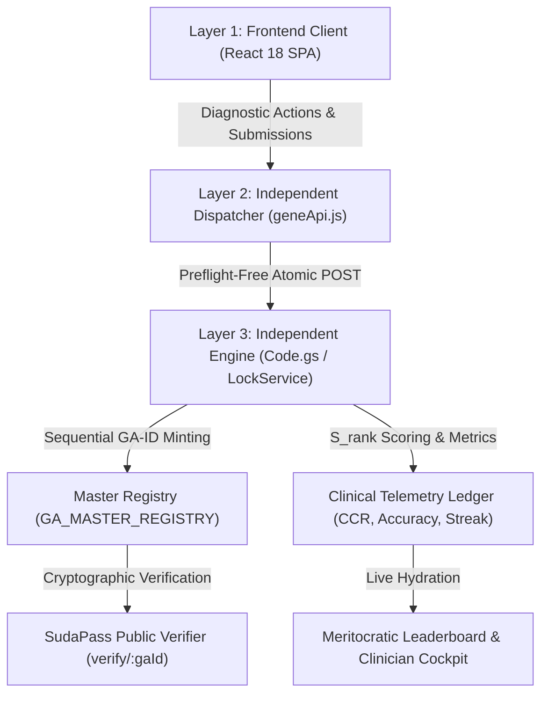

# Google for Startups MENA — Official Application Dossier
**Applicant Entity:** SudaGene Consortium (GeneAcademy® & GemIInI Academy)  
**Program Track:** Google for Startups Accelerator: MENA (HealthTech & AI Infrastructure)  
**Submission Date:** August 2026  
**Operational Hubs:** Cairo, Egypt • Khartoum, Sudan • Riyadh, KSA • Kuwait City  

---

## 1. Executive Summary & Startup Profile

### Company Overview
**SudaGene Consortium** is an academic and clinical HealthTech infrastructure platform operating across North Africa and the Middle East through two specialized, integrated pillars:
1. **GemIInI Academy:** A decentralized clinical licensure and surgical simulation platform providing Mechanism-to-Clinic (MTC™) training, AHA-compliant resuscitation, and Royal College-aligned surgical skills.
2. **GeneAcademy®:** A translational genomics and precision oncology research engine running 15:5:1 decentralized academic pods and molecular diagnostics pipelines.

* **Website & Web Platform:** [https://members.geneacademy.net](https://members.geneacademy.net) | [https://geneacademy.net](https://geneacademy.net)
* **Master Architecture:** React 18 SPA + Preflight-Free Telemetry Middleware + Google Cloud Backend + SudaPass Cryptographic Registry.
* **Current Stage:** Revenue-Generating / Live Production Telemetry / Seed-Stage Expansion.

---

## 2. Problem Statement: Post-Conflict Collapse of Medical Education & Credentialing

Following the outbreak of armed conflict in Sudan (April 2023), the nation's centralized healthcare, university, and credentialing infrastructure suffered catastrophic collapse:
* **Over 10,000+ Physicians & Trainees Displaced:** Medical graduates, surgical residents, and academic researchers were scattered across Egypt, the Gulf, and East Africa with zero access to physical universities, teaching hospitals, or clinical registries.
* **Paper-Based Credentialing Failure:** Physical hospital archives and university registries were destroyed or locked, preventing physicians from verifying academic standing for licensing bodies (NHS UK, German Approbation, Saudi SCFHS, Egyptian Medical Syndicate).
* **Clinical Training Hiatus:** Advanced surgical training, resuscitation accreditation (BLS/ACLS), and subspecialty examinations were abruptly terminated, creating severe regional medical workforce shortages.

---

## 3. The Technical Solution: The 3-Layer Independent Telemetry & Verification Engine

SudaGene engineered and deployed a zero-latency, fail-closed digital infrastructure designed to deliver distributed clinical education, simulate emergency medical decision-making, and issue tamper-proof verifiable credentials.



### Technical Architecture Components:
1. **Frontend Presentation (`MtcSimulationRunner.jsx` & `ProfileHeaderCard.jsx`):**
   * High-performance, responsive React interface built on an Obsidian design system (`#04080F`).
   * Renders interactive, 3-step acute emergency simulations (Diagnostic Triangulation $\rightarrow$ Pharmacological Stabilization $\rightarrow$ Definitive Revascularization).
2. **Middleware Dispatcher (`geneApi.js` & `IndependentService.js`):**
   * Dispatches preflight-free, low-latency POST payloads (`text/plain;charset=utf-8`) eliminating CORS negotiation overhead in bandwidth-constrained regions.
   * Maintains local session state synchronization and offline submission queuing.
3. **Backend Atomicity & Telemetry Ingestion (`Code.gs`):**
   * Executes under Google's 10,000ms `LockService` to guarantee atomic transaction isolation.
   * Atomically computes the **Composite Clinical Merit Score ($S_{\text{rank}}$)**:
     $$S_{\text{rank}} = \text{GP} + (\text{CCR} \times 10) + (\text{Accuracy}_{\text{MTC}} \times 5) + (\text{Streak} \times 20) + \text{Bonus}$$
   * Enforces automatic progression gating: scoring $\ge 70\%$ unlocks Level 2 advanced 40Q timed simulation blocks.

---

## 4. Empirical Traction & Commercial Validation

SudaGene is not an unvalidated prototype. Our platform is actively grading live physicians, running paid physical simulation camps, and processing daily regional transactions.

```
                      LIVE Independent TRACTION & EMPIRICAL METRICS
  
  ┌──────────────────────────────────────────────────────────────────────────────────────────────────┐
  │ 1. ACTIVE PHYSICIAN NETWORK: 1,201 Verified Clinicians & Scholars Across 90+ Medical Faculties  │
  │ • Sudan (Univ of Khartoum, Gezira, National Univ, Omdurman Islamic, Al-Neelain, Bahri)          │
  │ • Egypt (Cairo Univ Kasr Al-Ainy, Ain Shams, Alexandria, Mansoura) & Gulf Diaspora               │
  ├──────────────────────────────────────────────────────────────────────────────────────────────────┤
  │ 2. PHYSICAL SIMULATION REVENUE VALIDATION: $50 USD / Head B2C Unit Economics                     │
  │ • 25-Surgeon Wet-Lab Cohort: Basic Surgical Skills (BSS-1 & BSS-2) Cairo Cohort                 │
  │ • 2-Day Royal College-Compliant Hands-On Intensive: Suturing geometry, anastomoses, laparoscopy   │
  ├──────────────────────────────────────────────────────────────────────────────────────────────────┤
  │ 3. PRODUCTION DIAGNOSTIC TELEMETRY (Real-World Baseline Standings)                               │
  │ • 🥇 GA-3521 (Dr. Elshareef Osman, Univ of Khartoum '21): 750 GP • 92.5% Accuracy • Level 2 Pass │
  │ • 🥈 GA-305  (Dr. Ehssan Isam, National University NUSU): 750 GP • 88.0% Accuracy • Level 2 Pass │
  │ • 🥉 GA-3479 (Dr. Hala Sid Ahmed, Univ of Khartoum '22): 500 GP • 86.5% Accuracy • Level 2 Pass │
  │ • 4️⃣ GA-2491 (Dr. Tanzeel Mohamed, National Univ '23): 500 GP • 84.0% Accuracy • Level 2 Pass   │
  └──────────────────────────────────────────────────────────────────────────────────────────────────┘
```

---

## 5. Why Google Cloud & Gemini AI: Scaling Strategy

By joining Google for Startups MENA, SudaGene will transition its validated prototype architecture into a globally scalable, AI-powered clinical intelligence platform.

```
  Current Architecture (POC/MVP)                Google Cloud Target Production Architecture
  ┌───────────────────────────────┐              ┌──────────────────────────────────────────────┐
  │ React 18 SPA                  │              │ React 18 SPA on Google Cloud Run             │
  │ Google Apps Script (Code.gs)  │ ───────────> │ Go / Node.js Microservices on Cloud Run      │
  │ Google Sheets SSOT            │              │ Google Cloud Firestore + Cloud SQL           │
  │ Static MTC Case Scenarios     │              │ Gemini 1.5 Pro / Flash Multi-Modal Case AI   │
  │ Client-Side Telemetry Math    │              │ BigQuery Telemetry Analytics & Looker Studio │
  └───────────────────────────────┘              └──────────────────────────────────────────────┘
```

### Key Technical Integrations with Google Technology:
1. **Gemini 1.5 Pro / Flash for Dynamic Clinical Vignette Generation:**
   * Replace static scenario trees with Gemini-driven generative patient encounters.
   * Gemini dynamically models evolving hemodynamics, arterial blood gases, and ECG waveforms based on real-time candidate interventions.
2. **BigQuery & Looker Studio for National Health Workforce Telemetry:**
   * Ingest millions of diagnostic telemetry data points to identify regional clinical competency gaps across specialty cohorts.
3. **Google Cloud Run & Firestore:**
   * Scale from handling hundreds of concurrent exam takers to 50,000+ simultaneous global candidates with sub-100ms API response latency.
4. **Cloud KMS & Document AI for SudaPass Digital Credential Verification:**
   * Automate OCR extraction and cryptographic signing of legacy university diplomas and MBBS transcripts for instant NHS and international board recognition.

---

## 6. SudaGene Consortium Leadership Team

* **Dr. Mohamed Ahmed Gabriel (GA-000):** Founder & General Supervisor • Professor of Molecular Medicine, Faculty of Medicine, University of Khartoum • ASM ID: 200334812.
* **Dr. Alaa Mursi (GA-001):** Deputy Academic Supervisor & Clinical Training Director • Faculty of Medicine, University of Khartoum • Certified BLS Provider.
* **Dr. Safaa Hassan (GA-004):** Consultant Radiologist & Academic Director (Kuwait Regional Desk) • University of Gezira • Head of Online Resuscitation Accreditation.
* **Eng. Amjad Gorashi (GA-011):** Principal Systems Engineer & Operations Director • University of Khartoum • Lead Architect of Independent Telemetry Engine.

---

### 📞 Contact & Institutional Desk
* **Founder Desk:** `mohammed.a.gabriel@gmail.com`
* **Operations & Systems Desk:** `amjadgorashi32@gmail.com`
* **Commercial & B2B Inquiries:** `Bus.devlop.07@geneacademy.net`
* **Regional Telemetry Relay:** `+20 101 592 2628` (Egypt) | `+965 5087 2572` (Kuwait / Gulf)
