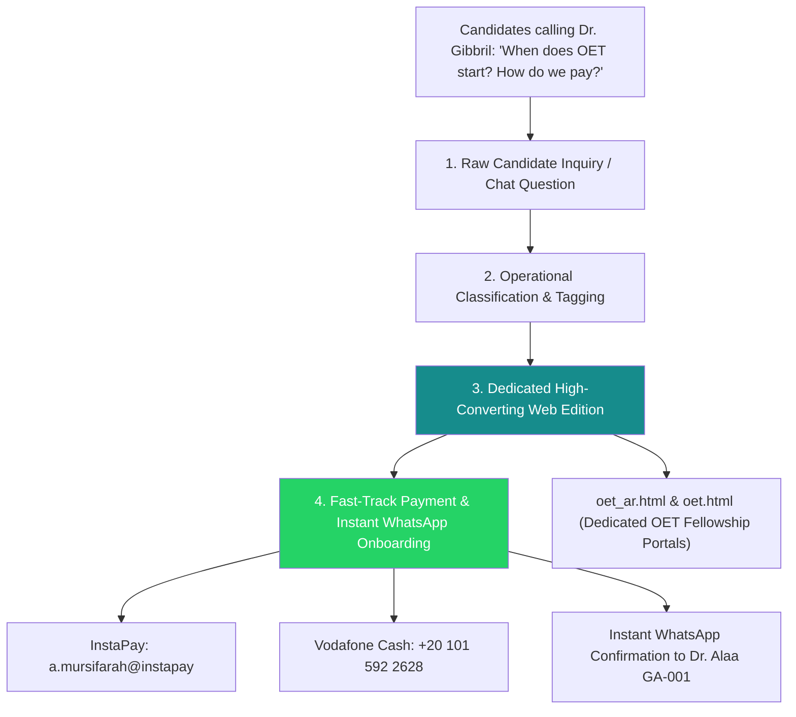
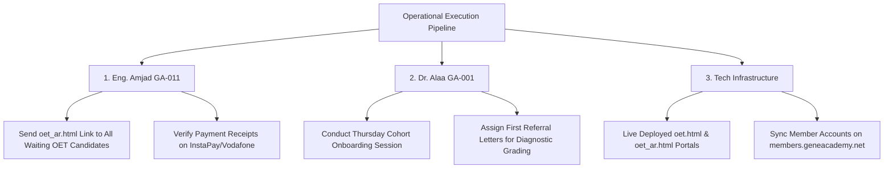

# 📥 Operational Chat Intelligence & Opportunity Translator

**Session Date:** September 4, 2026  
**Source Transcripts Processed:**
1. Executive & Academic Board Communications — Dr. Mohamed Gibbril (`GA-000`) & Dr. Alaa Mursi (`GA-001`) [Aug 27 – Sep 4, 2026]
2. GemIInI Jaib (جيميناي جيب) Companion App Community Feed — Member IDs `GA-3015` & `GA-3028` [Active Onboarding & Question Sharing]
3. Campaign Announcement & Intake UI Bug Fix — Facebook Campaign & Profile Gate Release [Sep 4, 2026]
4. Candidate Telemetry Dispatch & Legacy Form Migration — Dr. Maryam Yassir (`GA1136`), Noura (`GA2569`), `GA1139`, `GA1140` [Sep 4, 2026]

---

## 🏛️ The Transformation Blueprint: How Chat Questions Become Web Features & Conversions

---

## 🔮 Executive Translation & Active Web Assets

### 1. 🚀 Dedicated OET Fellowship Mobility Cohort Portals Live
* **The Operational Bottleneck:** Candidates calling Dr. Gibbril directly asking for OET start dates, fees, and syllabus details, causing executive friction and delayed sales.
* **Website Transformation Implemented:**
  - Created **[`oet_ar.html`](file:///g:/My%20Drive/GemIInI_Sovereign_Platform/oet_ar.html)** (100% Arabic) and **[`oet.html`](file:///g:/My%20Drive/GemIInI_Sovereign_Platform/oet.html)** (100% English).
  - Featured **Dr. Alaa Mursi (`GA-001` - FMRCS, Letterkenny University Hospital, Ireland)** as Lead Mentor.
  - Outlined the 4 OET Sub-tests (Writing, Speaking, Reading, Listening) with individual letter correction.
  - Embedded **Thursday Cohort Onboarding** schedule.
  - Linked directly in the navigation menus of [`index_ar.html`](file:///g:/My%20Drive/GemIInI_Sovereign_Platform/index_ar.html) and [`index.html`](file:///g:/My%20Drive/GemIInI_Sovereign_Platform/index.html).

---

### 2. ⚡ Direct Payment & Fast-Track Onboarding Channels
* **Payment Gateways Configured on Web Portals:**
  - **InstaPay (Egypt/UK/EU):** `a.mursifarah@instapay` (Dr. Alaa Mursi Official)
  - **Vodafone Cash:** `+20 101 592 2628` (Instant Wallet Transfer)
* **Single-Click WhatsApp Receipt Dispatch:**  
  Candidates click one button to dispatch payment receipt directly to Dr. Alaa (`GA-001`) and Admissions Desk (`GA-011`):  
  `https://wa.me/201015922628?text=مرحباً%20د.%20آلاء،%20أود%20تأكيد%20تسجيلي%20في%20دفعة%20OET%20وإرسال%20إيصال%20السداد.`

---

### 3. 🟢 Candidate Onboarding & Legacy Form Auto-Ingestion
* **Dr. Maryam Yassir (`GA1136`)**: House Officer at Al-Nau Hospital enrolled into Dr. Alaa's MRCS & Surgical Skills Cohort on `members.geneacademy.net`.
* **GA-ID Credentials Dispatch**: Auto-send login parameters to `GA1136`, `GA1139`, `GA1140`, `GA2569`.

---

### 4. 🏆 Weekly Friday Gamification: "The GemIInI Pulse"
* **Friday Leaderboard**: Top 10 rankings published weekly on social channels using live SudaPass points.
* **Peer Pair Competitions**: Pairing active doctors (e.g. `GA3015` vs `GA3028`) to solve MTC clinical vignettes.

---

### 5. 🛠️ Code Fix: Infinite Loop on "Begin Gently" Onboarding Screen
* **Status:** FIXED in [`join.html`](file:///g:/My%20Drive/GemIInI_Sovereign_Platform/join.html) & [`join_ar.html`](file:///g:/My%20Drive/GemIInI_Sovereign_Platform/join_ar.html). `gemiini_user_ga` stored in `localStorage`, bypassing Screen 1 on re-visit.

---

## 🛠️ Actionable Execution Matrix (Next 48 Hours)

