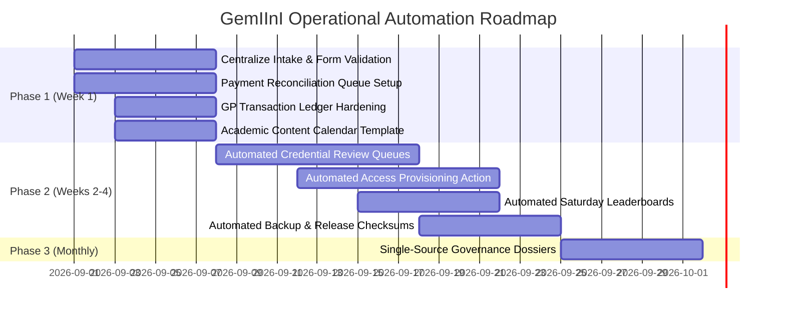

# 🏛️ GemIInI SudaGene Platform — Prioritized Automation Plan (2026–2027)
**Effective Date:** September 1, 2026  
**Operational Mandate:** Automate Movement · Template Communication · Ground Human Approval

---

## 🧭 Executive Summary & Core Principle

The GemIInI SudaGene Platform and GeneAcademy operate as a medical and life-science education ecosystem comprising:
1. Public institutional portal (`geneacademy.net`)
2. The **GemIInI Jaib (جيميناي جيب)** members application (`members.geneacademy.net`)
3. Clinical education, simulations, exams, and mentorship
4. Physical clinical workshops (STC Dokki, AHA Lic. 1549)
5. Admissions and credential verification (SudaPassâ„¢ SHA-256)
6. Sovereign payment rail (Vodafone Cash)
7. Institutional partnerships and ministerial reporting

### ⚖️ The Governing Architecture:
> **"Automate repetitive movement. Template recurring communication. Keep human judgment at every academic, financial, credential, and governance decision point."**

---

## 📋 1. Registration, Intake, and Cohort Routing
* **Automation Level:** Fully Automated Data Movement + Human Eligibility Gate.
* **Automate:**
  * Website form submissions (`join.html`, `start.html`) into `MASTER_AUTH`.
  * Duplicate-email and duplicate-phone collision detection.
  * Automatic status assignment: `NEW`, `PENDING_REVIEW`, `VERIFIED`, `PAYMENT_PENDING`, `ENROLLED`, `REJECTED`.
  * Automatic pathway triage: SMC, AHA BLS, OET, USMLE, MRCS, Molecular Research, B2B Partnership.
* **Keep Human Approval For:**
  * Institutional affiliation and medical credentials.
  * Eligibility decisions and suspicious/conflicting applications.

---

## 💳 2. Payment Reconciliation & Access Activation
* **Automation Level:** Automated Matching + One-Click Approval Gate.
* **Automate:**
  * Import transaction references into `PAYMENT_AUDIT_LOG`.
  * Automated matching of reference, amount, phone, email, and cohort ID.
  * Categorization: `MATCHED`, `PARTIAL_MATCH`, `UNMATCHED`, `DUPLICATE`, `REFUND_REVIEW`.
  * Pre-generate one-click access provisioning action.
* **Do NOT Fully Automate:**
  * Refunds, faculty disbursements, unusual payment amounts.
  * Access or GP granting on disputed/unverified receipts.

---

## 🔐 3. Credential Verification & Member-ID Issuance
* **Automation Level:** Workflow Automation + Human Review Gate.
* **Automate:**
  * Auto-assign verification case numbers.
  * Pre-check duplicate records across phone, email, and national registry.
  * Produce complete verification audit trails.
* **Keep Human Approval For:**
  * Medical qualification review.
  * SudaPassâ„¢ SHA-256 cryptographic seal issuance.

---

## 📚 4. Weekly Academic Publishing Pipeline
* **Automation Level:** Template-Driven + Medical Review Gate.
* **Create Reusable Templates For:**
  * Sunday Sessions, Monday Marathon, Saturday MedTalks, and OET Clinics.
  * 4-Tier MTCâ„¢ Vignettes ($\text{Mechanism} \rightarrow \text{Pathway} \rightarrow \text{Clinic} \rightarrow \text{PubMed}$).
  * Timed 40-Question Council-Validated Exam Blocks.
* **Keep Human Approval For:**
  * Clinical accuracy, council exam validation, and learner-facing medical guidance.

---

## 📢 5. Session Reminders & Cohort Communications
* **Automation Level:** Fully Automated Trigger Sequences.
* **Automate:**
  * Triggered reminders: 7 days, 24 hours, and 1 hour before masterclasses.
  * Post-session replay availability and feedback collection alerts.
  * Role-segmented messages based on candidate Level (Level 1–9) and Track.

---

## 🎮 6. GP Engine, Gated Access & Inactivity Sweeps
* **Automation Level:** Ledger-Based Automated Auditing.
* **Automate:**
  * GP credit transactions for verified activities (+25 baseline, +475 accredited, +500 workshop, +10 passed MTC case).
  * Saturday Leaderboard calculation and publishing.
  * 72-Hour inactivity sweeps to freeze stagnant provisional accounts.
* **Locked Invariant:**
  * Never silently overwrite or delete GP transaction history. The ledger is the immutable source of truth.

---

## 🛡️ 7. Backups, Release Packaging & Deployment Checks
* **Automation Level:** Fully Automated Snapshots + Human-Approved Restore.
* **Automate:**
  * Scheduled cold-storage database snapshots of Google Sheets.
  * Pre-deployment linting (broken links, missing assets, duplicate IDs, syntax validity).
  * Checksummed compilation of `geneacademy_release.zip`.
* **Keep Human Approval For:**
  * Production deployment to Hostinger, DNS changes, and database restoration.

---

## 📊 8. Monthly Financial & Governance Reporting
* **Automation Level:** Automated Compilation + Human Sign-Off.
* **Automate Preparation Of:**
  * Channel revenue, outstanding balances, workshop seat occupancy, active member telemetry.
* **Do NOT Automatically Distribute:**
  * Ministerial telemetry dossiers and national pass-rate claims require formal executive review before release.

---

## 🚫 What to Eliminate (Permanent Cleanups):
1. **Eliminate Manual Static JSON Editing:** Maintain master university data in a controlled master table and auto-generate `data/universities.json`.
2. **Eliminate Duplicated Master Data:** A single source of truth for member IDs, university names, and GP balances.
3. **Eliminate Manual Copy-Paste Reporting:** Monthly briefs must be compiled from operational database rows, never screenshots.
4. **Eliminate Unsourced Public Claims:** Every statistic must have verified source metadata attached.

---

## 🗓️ Phased Implementation Schedule:

